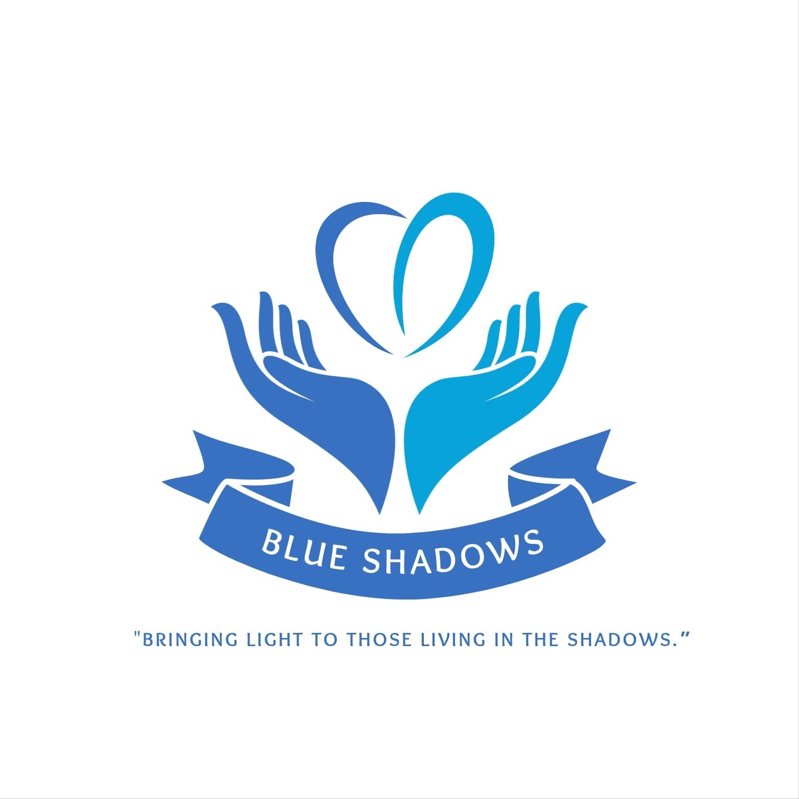

# Blue Shadows Foundation Website

A modern, responsive website for **Blue Shadows Foundation** - a non-profit organization dedicated to serving society through healthcare support, educational assistance for the poor, awareness programs, and community development initiatives.

## About Blue Shadows Foundation

> "Bringing light to those living in the shadows."

Blue Shadows Foundation is a non-profit organization committed to improving lives through:
- Free Medical Camps
- Health Awareness Programs
- Education Support for Underprivileged Children
- Rural Support
- Emergency Help Initiatives
- Youth Awareness Programs

**Registration No:** 261/2025

**The Backbone of Our Mission:** Pamula Prakash Deep - A young entrepreneur whose vision and dedication drive our commitment to create positive change in society.

## Website Features

- **Responsive Design** - Works seamlessly on desktop, tablet, and mobile devices
- **Animated Logo** - Floating and glowing animation on homepage
- **Multi-page Navigation** - Home page and dedicated Founders page
- **Video Integration** - YouTube Shorts embedded in Impact Stories section
- **Photo Gallery** - Real photos from community activities
- **Elegant Typography** - Playfair Display + Inter font combination
- **Blue & White Theme** - Professional NGO color scheme

## Website Sections

| Section | Description |
|---------|-------------|
| **Homepage** | Hero section with animated logo and mission statement |
| **About Us** | Organization info, founder highlight, vision & mission |
| **Services** | 6 service cards showcasing our programs |
| **Gallery** | Photo gallery from medical camps and community support |
| **Impact Stories** | YouTube Shorts videos showcasing our work |
| **Founders** | Dedicated page with founders' photo and names |

## Tech Stack

- **React 18** - Frontend framework
- **Vite** - Build tool
- **React Router** - Multi-page navigation
- **CSS3** - Custom styling with animations
- **GitHub Pages** - Free hosting & deployment

## Contact Information

- **Email:** blueshadowsfoundation@gmail.com
- **Phone:** 78283 23456
- **Location:** Razole, Malikipuram, Amalapuram
- **Instagram:** [@bluee_shadowss](https://www.instagram.com/bluee_shadowss)

## Founders

- N. Kiran Kumar
- J. Jairaj
- K. Naveen Kumar
- Ch. Siddhartha

## Live Website

Visit the live website at: [GitHub Pages URL](https://karthik-ganti.github.io/BlueShadows)

---

&copy; 2025 Blue Shadows Foundation. All rights reserved.
